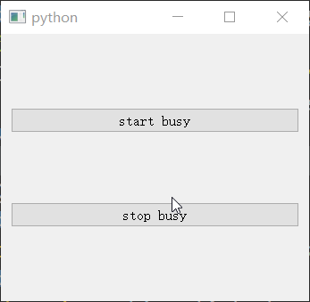

# Demo

- 目录
  - [重启窗口Widget](#1重启窗口Widget)
  - [简单的窗口贴边隐藏](#2简单的窗口贴边隐藏)
  - [嵌入外部窗口](#3嵌入外部窗口)
  - [简单跟随其它窗口](#4简单跟随其它窗口)
  - [简单探测窗口和放大截图](#5简单探测窗口和放大截图)
  - [无边框自定义标题栏窗口](#6无边框自定义标题栏窗口)
  - [右下角弹出框](#7右下角弹出框)
  - [程序重启](#8程序重启)
  - [自定义属性](#9自定义属性)
  - [调用截图DLL](#10调用截图DLL)
  - [单实例应用](#11单实例应用)
  - [简单的右下角气泡提示](#12简单的右下角气泡提示)
  - [右侧消息通知栏](#13右侧消息通知栏)
  - [验证码控件](#14验证码控件)
  - [人脸特征点](#15人脸特征点)
  - [使用Threading](#16使用Threading)
  - [背景连线动画](#17背景连线动画)
  - [无边框圆角对话框](#18无边框圆角对话框)
  - [调整窗口显示边框](#19调整窗口显示边框)
  - [判断信号是否连接](#20判断信号是否连接)
  - [调用虚拟键盘](#21调用虚拟键盘)
  - [动态忙碌光标](#22动态忙碌光标)

## 1、重启窗口Widget
[运行 RestartWindow.py](RestartWindow.py)

利用类变量对窗口的变量进行引用，防止被回收（导致窗口一闪而过），重启时先显示新窗口后关闭自己

## 2、简单的窗口贴边隐藏
[运行 WeltHideWindow.py](WeltHideWindow.py)

1. 大概思路
    1. 思路是当窗口进入左边，顶部，右边一半时，此时判断窗口的坐标
    1. 如果窗口的x坐标小于0 则需要隐藏到左边
    1. 如果窗口的y坐标小于0 则需要隐藏到顶部
    1. 如果窗口的x坐标大于屏幕宽度-窗口宽度/2 则需要隐藏到右边

2. 事件说明
    1. `mousePressEvent`，鼠标按下事件，主要记录按下的坐标
    1. `mouseMoveEvent`，鼠标移动事件，用于移动窗口
    1. `mouseReleaseEvent`，鼠标弹起事件，用于判断是否需要隐藏窗口
    1. `enterEvent`，鼠标进入事件，用于窗口隐藏后，是否需要暂时显示预览
    1. `leaveEvent`，鼠标离开事件，用于窗口暂时显示后自动隐藏效果

## 3、嵌入外部窗口
[运行 EmbedWindow.py](EmbedWindow.py)

1. 使用`SetParent`函数设置外部窗口的`parent`为Qt的窗口
1. Qt使用`QWidget.createWindowContainer(QWindow.fromWinId(窗口ID))`生成QWidget
1. 使用`GetWindowLong`得到原来窗口的样式属性`style = win32gui.GetWindowLong(hwnd, win32con.GWL_STYLE)`和`exstyle = win32gui.GetWindowLong(hwnd, win32con.GWL_EXSTYLE)`
1. 这里还原窗口后不会显示，用spy++发现没有了WS_VISIBLE样式（未解决）

## 4、简单跟随其它窗口
[运行 FollowWindow.py](FollowWindow.py)

1. 利用win32gui模块获取目标窗口的句柄
1. 通过句柄获取目标窗口的大小位置，并设置自己的位置
1. 当句柄失效时关闭自己
1. 主要是检测时间，在10毫秒以下很流畅

## 5、简单探测窗口和放大截图
[运行 ProbeWindow.py](ProbeWindow.py)

1. 利用`win32gui`模块获取鼠标所在位置的窗口大小(未去掉边框)和rgb颜色
1. 利用一个全屏的全透明鼠标穿透的窗口（目的在于绘制矩形框和截图）

## 6、无边框自定义标题栏窗口
[运行 FramelessWindow.py](FramelessWindow.py) | [运行 NativeEvent.py](NativeEvent.py)

1. 重写鼠标事件

    1. 使用一个`QWidget`（`FramelessWindow`）作为父窗口, 一个`TitleBar`作为标题栏, 一个`QWidget`作为底部容器
    1. 父窗口`FramelessWindow`设置为背景透明，但是需要绘制一定宽度的透明度很高的矩形边框用来接受鼠标事件（变形鼠标样式进行调整窗口大小）
    1. `TitleBar`的最小化最大化关闭等按钮事件关联到父窗口里
    1. `TitleBar`中的鼠标按下移动事件得到坐标也传递到父窗口调用move方法进行窗口移动

2. windows api

    1. 使用`win32gui`设置薄边框
    1. 重写`nativeEvent`事件拦截边框的系统边框的显示，并返回各个方向

## 7、右下角弹出框
[运行 WindowNotify.py](WindowNotify.py)

## 8、程序重启
[运行 AutoRestart.py](AutoRestart.py)

## 9、自定义属性
[运行 CustomProperties.py](CustomProperties.py)

## 10、调用截图DLL
[运行 ScreenShotDll.py](ScreenShotDll.py)

## 11、单实例应用
[运行 SingleApplication.py](SingleApplication.py) | [运行 SharedMemory.py](SharedMemory.py)

1. QSharedMemory
2. QLocalSocket, QLocalServer

## 12、简单的右下角气泡提示
[运行 BubbleTips.py](BubbleTips.py)

1. 使用 `QWidget` 包含一个 `QLabel`, 其中 `QWidget` 通过 `paintEvent` 绘制气泡形状
2. 使用 `QPropertyAnimation` 属性动画来移动气泡和改变气泡的透明度
3. 使用 `QParallelAnimationGroup` 动画组来同时运行两个动画

## 13、右侧消息通知栏
[运行 Notification.py](Notification.py)

## 14、验证码控件
[运行 VerificationCode.py](VerificationCode.py)

1. 更新为paintEvent方式,采用上下跳动
2. 参考网上一些代码，都是采用paintEvent绘制，这里采用QLabel显示html结合字体来显示文字 
然后在paintEvent中绘制噪点和线条

## 15、人脸特征点
[运行 FacePoints.py](FacePoints.py)

PyQt 结合 Opencv 进行人脸检测；
由于直接在主线程中进行特征点获取，效率比较低

 依赖文件
 
1. [opencv](https://www.lfd.uci.edu/~gohlke/pythonlibs/#opencv)
2. [numpy](https://www.lfd.uci.edu/~gohlke/pythonlibs/#numpy)
3. [dlib](http://dlib.net/)
  1. [dlib-19.4.0.win32-py2.7.exe](Data/dlib-19.4.0.win32-py2.7.exe)
  2. [dlib-19.4.0.win32-py3.4.exe](Data/dlib-19.4.0.win32-py3.4.exe)
  3. [dlib-19.4.0.win32-py3.5.exe](Data/dlib-19.4.0.win32-py3.5.exe)
4. [shape-predictor-68-face-landmarks.dat.bz2](http://dlib.net/files/shape_predictor_68_face_landmarks.dat.bz2)

## 16、使用Threading
[运行  QtThreading.py](QtThreading.py)

在PyQt中使用Theading线程

## 17、背景连线动画
[运行 CircleLine.py](CircleLine.py)

主要参考 [背景连线动画.html](Data/背景连线动画.html)

## 18、无边框圆角对话框
[运行 FramelessDialog.py](FramelessDialog.py)

1. 通过设置 `self.setWindowFlags(self.windowFlags() | Qt.FramelessWindowHint)` 和 `self.setAttribute(Qt.WA_TranslucentBackground, True)` 达到无边框和背景透明
2. 在`QDialog`中放置一个`QWidget`作为背景和圆角
3. 在`QWidget`中放置其他内容

## 19、调整窗口显示边框
[运行 ShowFrameWhenDrag.py](ShowFrameWhenDrag.py)

1. 全局设置是【】在控制面板中->调整Windows的外观和性能->去掉勾选 拖动时显示窗口内容】
2. 但是为了不影响其它应用,可以在窗口处理函数wndproc中对其进行判断处理
3. 必须先要替换wndproc为自己的函数
4. 当消息事件==WM_NCLBUTTONDOWN的时候, 先强制开启，然后处理完成后再还原

好处在于可以减少窗口更新的次数（用途有频繁渲染的界面）

## 20、判断信号是否连接
[运行 IsSignalConnected.py](IsSignalConnected.py)

通过 `isSignalConnected` 判断是否连接

## 21、调用虚拟键盘
[运行 CallVirtualKeyboard.py](CallVirtualKeyboard.py)

1. Windows上调用的是`osk.exe`
2. Linux上调用的是`florence`,`onboard`,`kvkbd`,这三种屏幕键盘需要自行安装

## 22、动态忙碌光标
[运行 GifCursor.py](GifCursor.py)

通过定时器不停的修改光标图片来实现动态效果

